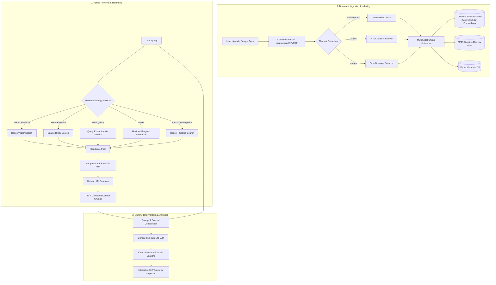

# NeoRAG — Multimodal Retrieval-Augmented Generation System

[](https://www.python.org/downloads/)
[](https://fastapi.tiangolo.com)
[](https://www.langchain.com)
[](https://www.trychroma.com)
[](https://ai.google.dev/)
[](LICENSE)

**NeoRAG** is an educational, end-to-end **Retrieval-Augmented Generation (RAG)** system built in Python and React. It demonstrates the internal mechanics of modern RAG pipelines: multimodal document parsing, title-based chunking, 768-dimensional Gemini embeddings, ChromaDB vector indexing, Okapi BM25 sparse retrieval, Maximal Marginal Relevance (MMR), Reciprocal Rank Fusion (RRF), zero-shot LLM reranking, and evidence-grounded generation with interactive source citations.

> **Portfolio & Learning Project Disclaimer:**  
> NeoRAG was created as a portfolio project to demonstrate practical understanding of information retrieval, vector search math, and LLM orchestration. It is designed for local benchmarking and exploration, **not as a commercial multi-tenant SaaS**. User data and uploaded files are treated as **ephemeral/temporary**.

---

## 📑 Table of Contents

- [Project Overview](#-project-overview)
- [System Architecture](#-system-architecture)
- [How the RAG Pipeline Works](#-how-the-rag-pipeline-works)
- [Deep Dive: Maximum Marginal Relevance (MMR)](#-deep-dive-maximum-marginal-relevance-mmr)
- [Deep Dive: Reranking (Vector Search vs. Neural Reranking)](#-deep-dive-reranking-vector-search-vs-neural-reranking)
- [Multimodal Document Processing](#-multimodal-document-processing)
- [Technology Stack](#-technology-stack)
- [Repository Structure](#-repository-structure)
- [Getting Started (Windows Setup Guide)](#-getting-started-windows-setup-guide)
- [API Documentation](#-api-documentation)
- [Ephemeral Data Policy](#-ephemeral-data-policy)
- [Example End-to-End Walkthrough](#-example-end-to-end-walkthrough)
- [Why Each Technique Was Chosen](#-why-each-technique-was-chosen)
- [Known Limitations](#-known-limitations)
- [RAG Evaluation Framework](#-rag-evaluation-framework)
- [Future Improvements](#-future-improvements)
- [Interactive Demo Guide](#-interactive-demo-guide)
- [Publishing to GitHub](#-publishing-to-github)

---

## 💡 Project Overview

### What Problem Does RAG Solve?
Standard Large Language Models (LLMs) suffer from three fundamental constraints:
1. **Knowledge Cutoffs:** They cannot answer questions about private documents or events occurring after their training run.
2. **Hallucination:** When unsure, LLMs frequently fabricate plausible-sounding yet factually incorrect statements.
3. **Lack of Attribution:** Standard LLM completions cannot cite the exact paragraph or page number where a piece of information originated.

**Retrieval-Augmented Generation (RAG)** addresses these issues by decoupling knowledge retrieval from language reasoning. When a question is received, the system retrieves relevant evidence from an indexed knowledge base and passes it into the LLM's prompt context, grounding the completion strictly in verified facts.

### What NeoRAG Demonstrates
- **Document Ingestion & Element Parsing:** Partitioning PDF, Markdown, and text files into structural elements (titles, text, tables, images).
- **Semantic Chunking:** Preserving document semantics using title-based hierarchical chunking rather than naive character slicing.
- **Dense & Sparse Hybrid Retrieval:** Combining semantic vector search (ChromaDB + Gemini Embeddings) with keyword search (BM25 Okapi).
- **Rank Fusion:** Fusing multiple retrieval ranked lists using Reciprocal Rank Fusion (RRF).
- **Diversity Optimization:** Mitigating near-duplicate results with Maximal Marginal Relevance (MMR).
- **Neural Reranking:** Zero-shot cross-encoder reranking using Gemini LLM structured outputs.
- **Multimodal Context Injection:** Preserving table HTML and image payloads for multimodal synthesis.
- **Interactive Source Attribution:** Transparent footnote citations (`[1]`, `[2]`) linked to source documents and page numbers.
- **Full Pipeline Observability:** Timing every stage in milliseconds and recording complete telemetry runs in SQLite.

---

## 🏗️ System Architecture



---

## ⚙️ How the RAG Pipeline Works

The NeoRAG pipeline processes information across distinct, observable stages:

| # | Pipeline Stage | Technology | Input | Output | Why It Is Needed |
|---|---|---|---|---|---|
| **1** | **Document Ingestion** | FastAPI, Python File I/O | PDF, TXT, or MD file stream | Sanitized file saved to `uploads/` | Enforces 25MB file limits and guards against path traversal (`safe_join`). |
| **2** | **Document Parsing** | `unstructured`, `pypdf` | Raw document bytes | List of categorized elements (Title, Text, Table, Image) | Separates structural elements from body text; extracts raw HTML for tables and base64 for figures. |
| **3** | **Title-Based Chunking** | `app.services.chunker` | Structured elements list | Coherent chunks (`DocumentChunkModel`) | Naive chunking cuts sentences in half; title chunking groups text under relevant section headers. |
| **4** | **Multimodal Enhancement** | Gemini API (`gemini-3.5-flash-lite`) | Chunks with tables/images | Enhanced chunks with summary context | Generates textual descriptions of visual data so non-text elements become searchable via text embeddings. |
| **5** | **Embedding Generation** | `langchain_google_genai` | Chunk page content strings | 768-dimensional float vectors | Maps document semantics into high-dimensional vector space (`models/gemini-embedding-001`). |
| **6** | **Vector Storage** | `ChromaDB` (Persistent) | Vectors + Chunk metadata | Persistent vector collection | Enables sub-second nearest-neighbor similarity search (HNSW index). |
| **7** | **BM25 Indexing** | `rank-bm25` (Okapi BM25) | Tokenized chunk text | In-memory inverted index | Dense vector search misses exact keywords (part numbers, acronyms, code names); BM25 handles exact terms. |
| **8** | **Query Expansion** | Gemini Structured Output | Raw user query string | 3 diverse sub-queries | Overcomes vocabulary mismatch by generating synonyms, technical variations, and sub-questions. |
| **9** | **Initial Candidate Retrieval** | ChromaDB & BM25 | Query string / variations | Raw candidate chunks ($K=10..30$) | Gathers a wide candidate pool from both semantic and lexical angles. |
| **10** | **Maximal Marginal Relevance (MMR)** | `app.services.mmr_service` | Candidates + Query vector | Deduplicated diverse subset | Penalizes redundant candidate chunks that share high similarity with already-selected items. |
| **11** | **Reciprocal Rank Fusion (RRF)** | `app.services.rrf_service` | Multiple ranked lists | Unified scored candidate list | Merges vector ranks and BM25 ranks without needing cross-distribution score normalization. |
| **12** | **Neural Reranking** | Gemini LLM Zero-Shot Reranker | Top candidates + User query | Reranked candidate list with explanations | Cross-attends query directly to full chunk text, catching subtle logical criteria vector cosine similarity overlooks. |
| **13** | **Context Construction** | `app.services.generation_service` | Top-$K$ reranked chunks | Structured prompt context | Structures text, tables, and image payloads with clean source labels `[Source 1]`, `[Source 2]`. |
| **14** | **Answer Generation** | Gemini 3.5 Flash-Lite | Context + Instructions + Query | Structured technical answer | Generates clear, evidence-grounded prose with compact numerical citations (`[1]`, `[2]`). |
| **15** | **Telemetry Logging** | SQLite (`pipeline_runs`) | Pipeline timings + source list | Telemetry record (`run_id`) | Records exact millisecond latency per stage for transparency and performance audits. |

---

## 🎯 Deep Dive: Maximum Marginal Relevance (MMR)

### Why Ordinary Similarity Search Fails
When an embedding model performs standard cosine similarity search, it retrieves the $K$ nearest vectors to the query. In multi-page documents (e.g., technical papers with repeated abstracts, section summaries, or overlapping slide decks), the top 5 nearest neighbors are often **near-identical duplicates** of each other. This wastes the LLM's context window and omits complementary information.

### What MMR Optimizes
Maximal Marginal Relevance (Carbonell & Goldstein, 1998) simultaneously optimizes for **query relevance** and **context diversity**:

$$\text{MMR} = \arg\max_{D_i \in R \setminus S} \left[ \lambda \cdot \text{Sim}_1(D_i, Q) - (1 - \lambda) \max_{D_j \in S} \text{Sim}_2(D_i, D_j) \right]$$

Where:
- $Q$ is the user query.
- $R$ is the candidate pool retrieved from the vector store ($\text{fetch\_k}$, e.g. 10 candidates).
- $S$ is the set of chunks already selected for the final context ($k$, e.g. 3 candidates).
- $R \setminus S$ represents the remaining unselected candidates.
- $\text{Sim}_1(D_i, Q)$ is the cosine similarity between candidate $D_i$ and query $Q$.
- $\text{Sim}_2(D_i, D_j)$ is the cosine similarity between candidate $D_i$ and already-selected chunk $D_j$.
- $\lambda \in [0, 1]$ is the diversity-relevance balance parameter:
  - $\lambda = 1.0$: Standard similarity search (maximum relevance, zero diversity penalty).
  - $\lambda = 0.0$: Maximum diversity (selects chunks maximally dissimilar from one another).
  - $\lambda = 0.5$ (NeoRAG Default): Balanced trade-off.

### Practical Example in NeoRAG
```python
# User requests k=3 diverse chunks from a candidate pool of fetch_k=10:
selected = mmr_service.calculate_mmr(
    query_vector=query_emb,
    candidate_vectors=candidate_embs,
    candidate_chunks=candidates,
    k=3,
    lambda_mult=0.5
)
```
1. **Selection 1:** The chunk with highest similarity to $Q$ is chosen.
2. **Selection 2:** For all remaining 9 candidates, the system subtracts $0.5 \times \text{similarity to Chunk 1}$. A chunk that is moderately relevant to the query but discusses a *different aspect* beats a near-duplicate of Chunk 1.
3. **Selection 3:** The process repeats, subtracting similarity against both Chunk 1 and Chunk 2.

---

## ⚖️ Deep Dive: Reranking (Vector Search vs. Neural Reranking)

### Why Vector Similarity Alone Is Insufficient
Bi-encoders (embedding models) compress an entire 3,000-character text chunk into a single vector (768 numbers). In doing so, fine-grained details, conditional logic, negative assertions ("do not use X when Y"), and exact numerical specifications can be diluted.

### How Reranking Works
| Dimension | Vector Search (Bi-Encoder) | Reranking (Cross-Encoder / LLM) |
|---|---|---|
| **Architecture** | Independent encoding: $v_q = E(Q)$, $v_d = E(D)$. Cosine dot product. | Joint evaluation: $LLM(Q, D)$ evaluates query and document together. |
| **Speed** | Sub-millisecond (vector index search). | Slower (requires deep transformer inference). |
| **Candidate Count** | Searches millions of chunks. | Evaluates top $10..30$ candidates. |
| **Nuance Capture** | Captures broad semantic topic. | Captures exact keyword presence, conditions, and reasoning. |

### NeoRAG's Implementation: Gemini LLM Reranker
Rather than relying solely on third-party cross-encoder services like Cohere, NeoRAG implements a **zero-shot LLM reranker** powered by Gemini with Pydantic structured output (`RerankOutput`):
```python
class RerankItem(BaseModel):
    candidate_index: int = Field(..., description="1-based candidate index")
    relevance_explanation: str = Field(..., description="1-sentence relevance rationale")

class RerankOutput(BaseModel):
    ranking: List[RerankItem]
```
The reranker reads all candidate snippets alongside the original query, re-orders them from most relevant to least relevant, and returns a justification for each rank. The final answer generator receives only the top reranked chunks.

---

## 🖼️ Multimodal Document Processing

NeoRAG treats documents as rich multimodal artifacts rather than flat text:

1. **Table Extraction & HTML Preservation:**
   - In financial, scientific, and technical papers, tabular numbers lose meaning when flattened into plaintext.
   - `Unstructured` parses tables into their original `HTML` structure.
   - During answer generation, HTML tables are explicitly injected into the prompt context so the LLM can analyze rows, columns, and headers accurately.

2. **Image Extraction & Base64 Handling:**
   - Diagrams, charts, and architectural figures are extracted as base64 images.
   - In PDF documents, image elements are linked to their respective section chunk.

3. **Multimodal Chunk Enhancement (`ENABLE_MULTIMODAL_SUMMARY`):**
   - When ingesting multimodal chunks, NeoRAG can invoke Gemini's vision capability to produce a detailed textual summary of figures and diagrams.
   - This summary is appended to the chunk text before embedding, allowing visual content to be retrieved via semantic text queries.

---

## 🛠️ Technology Stack

| Technology | Role in NeoRAG | Why Chosen |
|---|---|---|
| **Python 3.12** | Core Backend Language | Modern syntax, robust typing, asynchronous concurrency. |
| **FastAPI** | REST API Layer | High performance, native OpenAPI documentation, async support. |
| **LangChain** | RAG Orchestration | Modular abstractions for document loaders, text splitters, and vector store connectors. |
| **Google Gemini** | LLM & Embedding Engine | `gemini-3.5-flash-lite` provides sub-second inference; `gemini-embedding-001` provides 768-dim embeddings. |
| **ChromaDB** | Vector Database | Lightweight, open-source embedded vector database with persistent storage. |
| **Rank-BM25** | Lexical Search Engine | In-memory Okapi BM25 implementation for exact keyword matching. |
| **Unstructured / PyPDF** | Document Parsing | Layout-aware document partitioning with fallback mechanisms. |
| **SQLite** | Telemetry & Metadata DB | Zero-configuration relational storage for document records and execution traces. |
| **React 19 + Vite** | Frontend Interface | Responsive interactive UI featuring real-time telemetry inspection and neobrutalist styling. |
| **TailwindCSS** | Styling System | Utility-first CSS for crisp typography, layout, and visual feedback. |

---

## 📂 Repository Structure

```
NeoRAG/
├── backend/                        # Backend FastAPI service
│   ├── app/
│   │   ├── api/                    # REST API route handlers
│   │   │   ├── routes_chat.py      # /api/chat generation endpoint
│   │   │   ├── routes_documents.py # /api/documents upload & ingestion
│   │   │   ├── routes_health.py    # /health system telemetry check
│   │   │   └── routes_retrieval.py # /api/retrieval search & run history
│   │   ├── core/                   # Core application configuration
│   │   │   ├── config.py           # Pydantic BaseSettings & env resolution
│   │   │   ├── logging_config.py   # Structured logging configuration
│   │   │   └── security.py         # Rate limiter, security headers, path sanitization
│   │   ├── models/                 # Pydantic request & response schemas
│   │   │   ├── requests.py         # SearchRequest, ChatRequest, IngestRequest
│   │   │   └── responses.py        # HealthResponse, SearchResponse, ChatResponse
│   │   ├── services/               # Core RAG algorithmic services
│   │   │   ├── bm25_service.py     # Okapi BM25 keyword indexer & search
│   │   │   ├── chunker.py          # Title-based document chunker
│   │   │   ├── db_service.py       # SQLite document & run persistence
│   │   │   ├── document_parser.py  # Unstructured & PyPDF document partitioning
│   │   │   ├── embedding_service.py# Gemini 768-dim embeddings (with offline fallback)
│   │   │   ├── generation_service.py# Evidence-grounded answer synthesis
│   │   │   ├── hybrid_service.py   # Linear weighted vector + BM25 search
│   │   │   ├── mmr_service.py      # Maximal Marginal Relevance implementation
│   │   │   ├── multi_query_service.py# Gemini-powered query expansion
│   │   │   ├── multimodal_processor.py# Table HTML & image summary enrichment
│   │   │   ├── pipeline_service.py # End-to-end chat orchestration
│   │   │   ├── reranker_service.py # Gemini zero-shot LLM neural reranker
│   │   │   ├── retrieval_service.py# Multi-strategy retrieval coordinator
│   │   │   ├── rrf_service.py      # Reciprocal Rank Fusion calculation
│   │   │   └── vector_store.py     # ChromaDB persistence & similarity queries
│   │   ├── utils/                  # ID generators & path helpers
│   │   └── main.py                 # FastAPI application entrypoint
│   ├── docs/                       # Benchmark reference documents (Attention paper, etc.)
│   ├── tests/                      # Automated pytest unit & integration test suite
│   │   ├── test_api.py             # Route and security tests
│   │   ├── test_chunking.py        # Chunking strategy verification
│   │   ├── test_retrieval.py       # Retrieval and reranking tests
│   │   └── test_rrf.py             # RRF rank calculation math tests
│   ├── pytest.ini                  # Pytest async configuration
│   └── requirements.txt            # Backend dependencies list
├── docs/                           # Sample benchmark documents for testing
├── frontend/                       # React 19 + Vite frontend
│   ├── src/
│   │   ├── components/             # Reusable UI components
│   │   │   ├── neobrutalism/       # Neobrutalist buttons, cards, badges, selects
│   │   │   └── rag/                # RAG-specific UI (CleanAnswerRenderer, PipelineVisualizer)
│   │   ├── services/               # API client service (fetchHealth, executeChat, etc.)
│   │   ├── views/                  # Main views (ChatView, RetrievalPlaygroundView, DocumentsView, HistoryView)
│   │   ├── App.jsx                 # Application shell & navigation
│   │   └── main.jsx                # React root mount
│   ├── package.json                # Frontend dependencies (marked, lucide-react, tailwindcss)
│   └── vite.config.js              # Vite dev server configuration & backend proxy
├── .env.example                    # Clean environment variables template
├── .gitignore                      # Python, Node, and ephemeral data exclusions
├── CONTRIBUTING.md                 # Contribution guidelines
├── LICENSE                         # MIT License
├── package.json                    # Root proxy script configuration
├── pytest.ini                      # Root test configuration
├── README.md                       # Complete technical portfolio documentation
└── requirements.txt                # Root Python dependencies list
```

---

## 🚀 Getting Started (Windows Setup Guide)

Follow these step-by-step instructions to set up and run NeoRAG on a Windows machine.

### Prerequisites
- **Python 3.12+** installed ([python.org](https://www.python.org/downloads/)). Verify with `python --version`.
- **Node.js 18+ & npm** installed ([nodejs.org](https://nodejs.org/)). Verify with `node -v`.
- A free **Google Gemini API Key** from [Google AI Studio](https://aistudio.google.com/app/apikey).

### Step 1 — Clone the Repository
```powershell
git clone https://github.com/Pratyush11711/NeoRAG.git
cd NeoRAG
```

### Step 2 — Create and Activate Python Virtual Environment
In Windows PowerShell:
```powershell
python -m venv .venv
.\.venv\Scripts\Activate.ps1
```
*(If running Command Prompt `cmd.exe`, use: `.venv\Scripts\activate.bat`)*

### Step 3 — Install Python Dependencies
```powershell
pip install -r requirements.txt
```

### Step 4 — Configure Environment Variables
Copy the template `.env.example` to `backend/.env`:
```powershell
Copy-Item .env.example backend\.env
```
Open `backend\.env` in your text editor and insert your Gemini API key:
```env
GOOGLE_API_KEY=your_actual_gemini_api_key_here
GEMINI_CHAT_MODEL=gemini-3.5-flash-lite
GEMINI_EMBEDDING_MODEL=models/gemini-embedding-001
```

### Step 5 — Run Backend Test Suite
Verify that all unit tests pass cleanly:
```powershell
pytest backend/tests
```

### Step 6 — Start the Backend Server
From the project root:
```powershell
python -m uvicorn backend.app.main:app --host 127.0.0.1 --port 8000 --reload
```
The FastAPI backend will start at `http://127.0.0.1:8000`. You can inspect the interactive Swagger API documentation at [http://127.0.0.1:8000/docs](http://127.0.0.1:8000/docs).

### Step 7 — Start the React Frontend
Open a second PowerShell window, navigate to the project directory, and run:
```powershell
npm run dev
```
Open your browser and navigate to **[http://localhost:5173](http://localhost:5173)**.

---

## 📡 API Documentation

NeoRAG exposes a complete REST API. Below are the primary endpoints used for demonstration and testing:

### 1. System Health Check
`GET /health`
Returns system status, active models, collection name, document count, and active security settings.

**Example Response:**
```json
{
  "status": "ok",
  "version": "1.0.0",
  "gemini_chat_model": "gemini-3.5-flash-lite",
  "gemini_embedding_model": "models/gemini-embedding-001",
  "chroma_collection": "multimodal_rag_collection",
  "total_documents": 3,
  "total_chunks": 18,
  "security": {
    "rate_limiting": true,
    "requests_per_minute": 120,
    "max_upload_size_mb": 25,
    "api_key_required": false
  }
}
```

### 2. Document Upload
`POST /api/documents/upload`
Uploads a document (PDF, TXT, or MD) into temporary storage.

- **Request:** `multipart/form-data` with field `file`.
- **Response:** `200 OK`
```json
{
  "document_id": "doc_attention-is-all-you-need.pdf_a1b2c3d4",
  "filename": "attention-is-all-you-need.pdf",
  "file_size_bytes": 2215248,
  "status": "uploaded",
  "message": "Document uploaded successfully. Ready for ingestion."
}
```

### 3. Document Ingestion & Chunking
`POST /api/documents/{document_id}/ingest`
Parses the uploaded document, applies title chunking, extracts tables/images, generates embeddings, and indexes into ChromaDB and BM25.

- **Request Body (JSON):**
```json
{
  "force_reprocess": false,
  "enable_multimodal_summary": true,
  "max_characters": 3000,
  "new_after_n_chars": 2400
}
```

### 4. Load Sample Documents
`POST /api/documents/load-sample`
Instantly loads and indexes the built-in reference documents (`attention-is-all-you-need.pdf`, cheatsheets, guides) for rapid testing without manual uploads.

### 5. Multi-Strategy Search
`POST /api/retrieval/search`
Executes search using any of the 10 supported strategies.

- **Request Body (JSON):**
```json
{
  "query": "How does multi-head attention work?",
  "strategy": "hybrid_rerank",
  "k": 5,
  "vector_weight": 0.7,
  "bm25_weight": 0.3,
  "rrf_k": 60,
  "rerank_top_n": 10
}
```

### 6. Evidence-Grounded Chat
`POST /api/chat`
Full RAG pipeline: retrieval, fusion, reranking, context assembly, and Gemini synthesis with citations.

- **Request Body (JSON):**
```json
{
  "query": "What are the two main components of the Transformer architecture?",
  "strategy": "full_pipeline",
  "final_context_k": 3,
  "include_images": true
}
```
- **Response Structure:**
```json
{
  "run_id": "run_96a43cec5128",
  "query": "What are the two main components of the Transformer architecture?",
  "strategy": "full_pipeline",
  "answer": "The Transformer architecture consists of two primary components:\n\n1. **The Encoder:** Composed of a stack of 6 identical layers, each containing a multi-head self-attention mechanism and a position-wise fully connected feed-forward network [1].\n2. **The Decoder:** Also composed of a stack of 6 identical layers, introducing a third sub-layer that performs multi-head attention over the output of the encoder stack [1].",
  "sources": [
    {
      "source_id": "chunk_001",
      "document": "attention-is-all-you-need.pdf",
      "page": 2,
      "chunk_id": "sample_attention_chunk_0001",
      "retrieval_rank": 1,
      "reranker_rank": 1
    }
  ],
  "total_duration_ms": 1420.5
}
```

### 7. Telemetry & Run History
- `GET /api/retrieval/runs`: Returns the last 50 execution runs with latency metrics.
- `GET /api/retrieval/runs/{run_id}`: Returns the complete intermediate trace for a specific execution run.

---

## 🔒 Ephemeral Data Policy

NeoRAG is intentionally architected around an **ephemeral data model**:

1. **No Permanent User Storage:** This application does not maintain a permanent user database or persistent cloud storage for uploaded documents.
2. **Local Runtime Artifacts:** Uploaded files (`backend/data/uploads/`), processed element caches (`backend/data/processed/`), vector index files (`backend/data/chroma/`), and SQLite telemetry (`backend/data/metadata.db`) are local runtime artifacts.
3. **Excluded from Version Control:** All runtime databases and uploads are strictly excluded in `.gitignore`.
4. **Manual Cleanup:** You can reset the application to a completely fresh state at any time by deleting the runtime contents of `backend/data/`:
   ```powershell
   Remove-Item -Path "backend\data\uploads\*" -Recurse -Force
   Remove-Item -Path "backend\data\chroma\*" -Recurse -Force
   Remove-Item -Path "backend\data\metadata.db" -Force
   ```
   *(The application automatically recreates empty database schemas on next launch).*

---

## 🔬 Example End-to-End Walkthrough

Here is a walkthrough of querying the flagship reference paper (*Attention Is All You Need*):

1. **Ingestion:**
   - The user loads `attention-is-all-you-need.pdf`.
   - `Unstructured` partitions the 11-page paper into title elements, narrative paragraphs, formula text, and table HTML.
   - Title chunking produces 6 focused chunks preserving section headers like *"3.2.2 Multi-Head Attention"*.
2. **Indexing:**
   - Chunks are converted into 768-dimensional vectors using `gemini-embedding-001` and saved in ChromaDB.
   - Chunks are simultaneously tokenized into the in-memory BM25 index.
3. **Query:**
   - The user asks: *"What formula is used to calculate scaled dot-product attention?"*
4. **Hybrid Retrieval & RRF:**
   - Dense search retrieves top candidates based on vector similarity.
   - BM25 retrieves top candidates matching the exact keywords *"scaled dot-product attention formula"*.
   - Reciprocal Rank Fusion combines the ranked lists ($RRF = \sum \frac{1}{60 + \text{rank}}$).
5. **Reranking:**
   - The top 10 candidates are inspected by the Gemini zero-shot reranker, prioritizing the chunk containing the exact mathematical equation.
6. **Synthesis:**
   - Gemini 3.5 Flash-Lite generates an evidence-grounded answer citing `[1]`.
   - The frontend renders an interactive badge `[1]` that links directly to the cited source card and highlights it in yellow.

---

## 🧠 Why Each Technique Was Chosen

| Technique | Alternatives Considered | Trade-Off & Why Chosen |
|---|---|---|
| **Title-Based Chunking** | Fixed-size character slicing (e.g. 500 chars with 50 overlap) | Fixed slicing frequently cuts sentences, equations, and tables in half. Title chunking respects document structure and keeps related paragraphs together. |
| **Hybrid (Dense + Sparse)** | Vector-only retrieval | Vector-only search fails on exact identifiers, model names, and domain-specific acronyms. Hybrid search provides the semantic breadth of embeddings plus the precision of BM25. |
| **Reciprocal Rank Fusion** | Linear score weighting ($\alpha \cdot \text{Vector} + (1-\alpha) \cdot \text{BM25}$) | Linear weighting requires score normalization across wildly different distributions (cosine distances vs. unbounded BM25 scores). RRF is rank-based and robust across varied queries. |
| **Maximal Marginal Relevance** | Top-K similarity | Top-K returns near-duplicate chunks when documents repeat content. MMR balances relevance with diversity. |
| **LLM Neural Reranking** | Cross-encoder models (Cohere Rerank, BGE-Reranker) | Zero-shot LLM reranking utilizes Gemini's reasoning capacity without requiring external vendor API keys or heavyweight local torch models. |

---

## ⚠️ Known Limitations

In the spirit of technical honesty, NeoRAG has the following constraints:

1. **External API Latency:** Multi-query expansion, LLM reranking, and generation require sequential API calls to Gemini. On cold requests, full pipeline latency may reach $1.5 - 3.0$ seconds.
2. **Layout Model Fallback:** Advanced multimodal visual partitioning (`hi_res`) relies on system libraries (`poppler`, `tesseract`). If these native binaries are absent on the host OS, NeoRAG gracefully falls back to `pypdf` extraction, which extracts clean text but omits complex visual bounding boxes.
3. **Ephemeral In-Memory BM25:** The BM25 index is stored in memory and rebuilt from SQLite on startup. While fast and zero-dependency for thousands of chunks, very large enterprise scale ($>100,000$ documents) would benefit from an external search engine like Elasticsearch.
4. **Single-User Scope:** The SQLite database is designed for demonstration and development; concurrent write transactions from multiple simultaneous users would require PostgreSQL.

---

## 📊 RAG Evaluation Framework

While this repository is focused on pipeline architecture and visualization, a production RAG system should be benchmarked across standard RAG Triad metrics (e.g., via [RAGAS](https://github.com/explodinggradients/ragas)):

- **Faithfulness:** Does the generated answer contain *only* statements grounded in the retrieved context? (Measures hallucination rate).
- **Answer Relevance:** Does the answer directly address the user's prompt without extraneous fluff?
- **Context Precision:** Are the retrieved chunks at the top of the ranking actually relevant to answering the question? (Evaluates retrieval and reranking quality).
- **Context Recall:** Did the retrieval pipeline capture all necessary source passages required to answer the question?
- **Latency & Token Efficiency:** Millisecond response time per pipeline stage and tokens consumed per query.

---

## 🔮 Future Improvements

Planned enhancements for future iterations:
- [ ] **Streaming Responses:** Support Server-Sent Events (SSE) for streaming Gemini answer tokens in real-time.
- [ ] **Conversation Memory:** Implement multi-turn conversational context with sliding window memory.
- [ ] **Automated RAGAS Benchmarking:** Add an automated offline evaluation script that scores retrieval and generation accuracy across benchmark datasets.
- [ ] **Milvus / Qdrant Integration:** Provide optional vector database backends for multi-node deployments.
- [ ] **Local LLM Mode:** Add support for running local embedding and chat models via Ollama.

---

## 🧪 Interactive Demo Guide

To test the system and verify grounded answers, try these queries against the included benchmark paper:

1. **Architecture Basics:**
   > *"What are the two main components of the Transformer architecture?"*
   - **Expected Result:** Clear explanation of the 6-layer Encoder and 6-layer Decoder stacks, citing `[1]`.
2. **Formula Query:**
   > *"Explain the scaled dot-product attention formula and what each variable represents."*
   - **Expected Result:** Formatted equation `Attention(Q, K, V) = softmax((Q * Kᵀ) / √d_k) * V` with definitions for Query, Key, Value, and scaling factor $\sqrt{d_k}$.
3. **Performance Metrics:**
   > *"What BLEU score did the Transformer achieve on WMT 2014 English-to-German?"*
   - **Expected Result:** Specific BLEU score (28.4) with reference to the paper's results table.

---

## 🚢 Publishing to GitHub

To publish this project to your GitHub repository ([https://github.com/Pratyush11711/NeoRAG.git](https://github.com/Pratyush11711/NeoRAG.git)):

### Step 1 — Pre-Flight Checklist
Ensure no private files or keys are tracked:
```powershell
# 1. Verify .env is NOT tracked and .env.example contains no real keys
Get-Content .env.example -TotalCount 5

# 2. Verify all unit tests pass
pytest backend/tests
```

### Step 2 — Initialize Git Repository
```powershell
git init
```

### Step 3 — Stage Files
```powershell
git add .
```

Verify staged files with `git status` to ensure `.env`, `.venv/`, and `backend/data/` runtime files are not included.

### Step 4 — Commit & Push
```powershell
git commit -m "Initial commit: NeoRAG multimodal RAG system"
git branch -M main
git remote add origin https://github.com/Pratyush11711/NeoRAG.git
git push -u origin main
```

---

## 📄 License

This project is licensed under the MIT License — see the [LICENSE](LICENSE) file for details.
# NeoRAG

