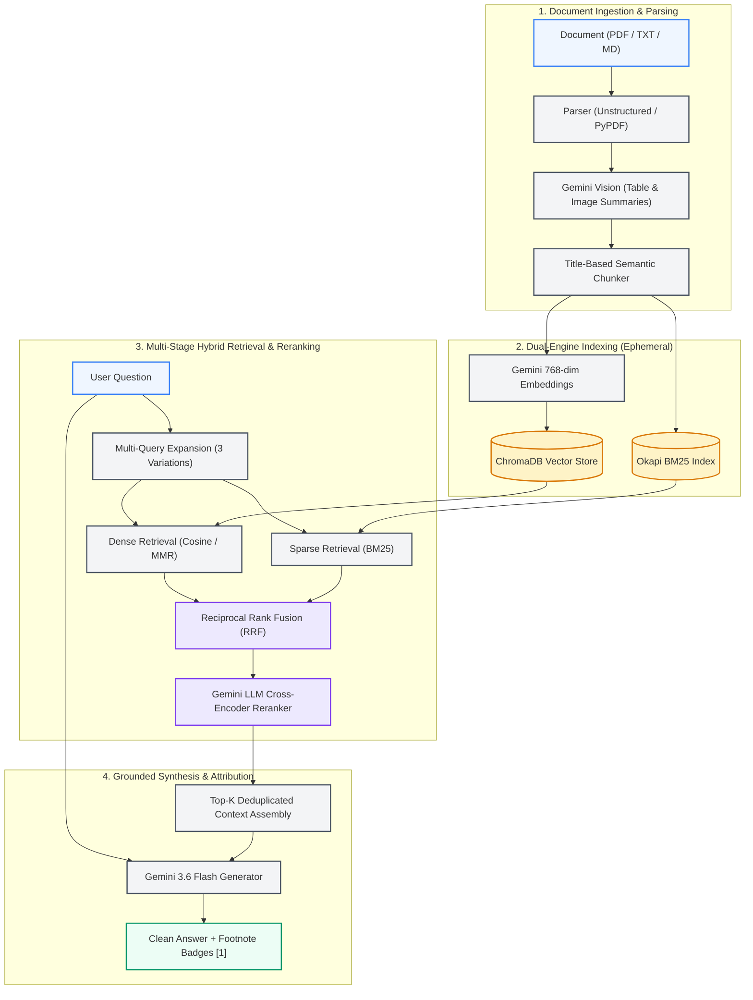

# ⚡ NeoRAG — Multimodal Retrieval-Augmented Generation System

[](https://www.python.org/)
[](https://fastapi.tiangolo.com)
[](https://react.dev/)
[](https://www.trychroma.com/)
[](https://ai.google.dev/)
[](LICENSE)

> **Portfolio & Learning Project:** An end-to-end, privacy-preserving **Multimodal RAG** system demonstrating production retrieval mechanics: **Title-based Chunking**, **Dense Vector Search (ChromaDB)**, **Sparse Keyword Search (Okapi BM25)**, **Reciprocal Rank Fusion (RRF)**, **Maximal Marginal Relevance (MMR)**, **Zero-Shot LLM Reranking**, and **Grounded Synthesis with Interactive Citations**.

---

## 📸 Key Capabilities

- **🔀 Hybrid Retrieval (Dense + Sparse):** Overcomes vector blindspots by merging dense semantic embeddings (`gemini-embedding-001`) with exact lexical matching (`BM25`).
- **📊 Reciprocal Rank Fusion (RRF):** Fuses multi-query vector searches and BM25 candidate ranks without requiring score normalization.
- **🎯 Maximal Marginal Relevance (MMR):** Eliminates duplicate passages by balancing candidate relevance against document diversity ($\lambda = 0.7$).
- **🧠 Cross-Encoder LLM Reranking:** Re-scores candidates using zero-shot Gemini reasoning to catch subtle context mismatches before context assembly.
- **🖼️ Multimodal Ingestion:** Preserves document structure (headers, text, tables, images) using Unstructured/PyPDF and Gemini Vision descriptions.
- **🔗 Interactive Citations:** Answers include numerical footnote badges (`[1]`, `[2]`) linked directly to the cited source cards and page numbers.
- **🛡️ Ephemeral & Privacy-First:** Zero persistent cloud database lock-in; uploaded documents and vector indexes are treated as temporary demonstration data.

---

## 🏛️ System Architecture



---

## 🔄 How the 4-Stage Pipeline Works

| Stage | Operation | Technology | Purpose |
|---|---|---|---|
| **1. Parse & Chunk** | Title-aware parsing & multimodal summarization | `unstructured`, `pypdf`, Gemini Vision | Keeps section headers intact; translates tables and diagrams into searchable text chunks. |
| **2. Dual Index** | Vector embedding + Token inverted index | `models/gemini-embedding-001`, `rank-bm25` | 768-dim dense vectors for semantic context; BM25 for precise keywords, formulas, and acronyms. |
| **3. Hybrid Retrieve & RRF** | Multi-query expansion & rank fusion | `LangChain`, Custom RRF ($k=60$) | Queries are expanded into 3 distinct forms; dense and sparse ranks are fused without score distortion. |
| **4. Rerank & Synthesize** | Cross-encoder evaluation & citation grounding | `gemini-3.6-flash`, Pydantic output | Evaluates chunk relevance against the user prompt; outputs verified facts with footnote source links. |

---

## 🧠 Core Information Retrieval Concepts

### 1. Hybrid Search & Reciprocal Rank Fusion (RRF)
Vector embeddings capture broad conceptual similarity, but frequently stumble on exact identifiers (e.g., model names, equation parameters, specific numbers). BM25 handles keywords accurately but fails on semantic paraphrasing.

NeoRAG runs both in parallel and fuses their ranks using **Reciprocal Rank Fusion (RRF)**:

$$RRF(d) = \sum_{m \in M} \frac{1}{k + r_m(d)}$$

- $M$: The set of retrieval systems (Dense Vector Search + BM25 Sparse Search).
- $r_m(d)$: The ordinal rank of document $d$ in system $m$.
- $k$: Smoothing constant ($k=60$) preventing high-ranking outliers from dominating.

---

### 2. Maximal Marginal Relevance (MMR)
Standard nearest-neighbor retrieval often returns nearly identical paragraphs from repeating sections. **MMR** maximizes relevance to the query while penalizing redundancy against already-selected documents:

$$MMR = \arg\max_{D_i \in R \setminus S} \left[ \lambda \cdot \text{Sim}_1(D_i, Q) - (1 - \lambda) \max_{D_j \in S} \text{Sim}_2(D_i, D_j) \right]$$

- **$\lambda = 1.0$**: Pure similarity search (standard Top-K).
- **$\lambda = 0.0$**: Maximum diversity across results.
- **$\lambda = 0.7$ (Default)**: Optimal balance ensuring relevant yet distinct context chunks.

---

### 3. Zero-Shot Neural Reranking
Vector cosine similarity independently measures candidate closeness to a query vector, ignoring complex cross-sentence dependencies. NeoRAG passes the top candidate chunks to **Gemini 3.6 Flash** acting as a cross-encoder:

1. Evaluates chunk contents simultaneously alongside the user question.
2. Assigns a relevance score ($0.0 - 1.0$) with explicit reasoning.
3. Filters irrelevant passages before injecting context into the final synthesis prompt.

---

## 💻 Tech Stack

| Component | Technology | Rationale |
|---|---|---|
| **Backend API** | [FastAPI](https://fastapi.tiangolo.com) + [Uvicorn](https://www.uvicorn.org/) | Async execution, automatic OpenAPI docs, Pydantic validation. |
| **Frontend** | [React](https://react.dev/) + [Vite](https://vitejs.dev/) | Ultra-responsive Neobrutalist UI, real-time pipeline visualizer. |
| **LLM & Embeddings** | [Google Gemini](https://ai.google.dev/) (`gemini-3.6-flash`, `gemini-embedding-001`) | Fast multimodal reasoning and 768-dim embeddings. |
| **Vector Database** | [ChromaDB](https://www.trychroma.com/) (Local) | Zero-infrastructure, in-memory/persisted SQLite vector store. |
| **Lexical Search** | [Rank-BM25](https://pypi.org/project/rank-bm25/) (Okapi BM25) | Exact token match retrieval complementary to dense embeddings. |
| **Document Parsing** | `unstructured`, `pypdf` | Structural extraction with automatic fallbacks. |
| **Security Layer** | Custom FastAPI Middleware | IP rate limiting, path traversal defense, and OWASP security headers. |

---

## 📂 Repository Structure

```text
NeoRAG/
├── backend/
│   ├── app/
│   │   ├── api/             # REST endpoints (chat, documents, retrieval, health)
│   │   ├── core/            # Security middleware, rate limiting, and app config
│   │   ├── models/          # Pydantic schemas for requests and responses
│   │   ├── services/        # RAG pipeline services (chunker, embeddings, mmr, rrf, reranker)
│   │   └── utils/           # ID utilities and JSON helpers
│   ├── data/                # Ephemeral runtime data (uploads, chroma, metadata.db)
│   ├── docs/                # Benchmark paper (Attention Is All You Need) & test assets
│   ├── scripts/             # Automated demo data and pipeline setup scripts
│   └── tests/               # 15 automated Pytest unit and integration tests
├── frontend/
│   ├── src/
│   │   ├── components/      # Neobrutalist UI elements and RAG inspection cards
│   │   ├── services/        # API client bindings
│   │   └── views/           # ChatView, DocumentsView, RetrievalPlayground, HistoryView
│   └── vite.config.js       # Vite configuration with backend reverse proxy
├── .env.example             # Clean environment variables template
├── requirements.txt         # Pinned Python backend dependencies
└── README.md
```

---

## 🚀 Getting Started

### Prerequisites
- **Python 3.11+** installed
- **Node.js 18+** installed
- **Google Gemini API Key** ([Get your free key here](https://aistudio.google.com/app/apikey))

---

### Step 1: Clone the Repository
```bash
git clone https://github.com/Pratyush11711/NeoRAG.git
cd NeoRAG
```

---

### Step 2: Configure Environment Variables
Copy `.env.example` to `backend/.env`:
```powershell
# Windows PowerShell
Copy-Item .env.example backend\.env
```
```bash
# Linux / macOS
cp .env.example backend/.env
```

Edit `backend/.env` and add your Gemini API key:
```env
GOOGLE_API_KEY=your_gemini_api_key_here
GEMINI_CHAT_MODEL=gemini-3.6-flash
GEMINI_EMBEDDING_MODEL=models/gemini-embedding-001
```

---

### Step 3: Run the Backend
```powershell
# Windows
python -m venv .venv
.venv\Scripts\Activate.ps1
pip install -r requirements.txt
uvicorn backend.app.main:app --host 127.0.0.1 --port 8000 --reload
```
```bash
# Linux / macOS
python3 -m venv .venv
source .venv/bin/activate
pip install -r requirements.txt
uvicorn backend.app.main:app --host 127.0.0.1 --port 8000 --reload
```
*API documentation and Swagger UI will be live at `http://127.0.0.1:8000/docs`.*

---

### Step 4: Run the Frontend
In a second terminal:
```bash
cd frontend
npm install
npm run dev
```
*Open `http://localhost:5173` in your browser.*

---

## 🧪 Testing the Demo

1. Navigate to the **Documents** tab and click **"Load Benchmark Paper"** to ingest *Attention Is All You Need* (`attention-is-all-you-need.pdf`).
2. Open the **Chat** tab and ask:
   > *"What are the key components of the Transformer architecture and how does scaled dot-product attention work?"*
3. **Verify the Results:**
   - **Grounded Answer:** Clean explanation referencing the 6-layer encoder/decoder stacks and attention formula.
   - **Interactive Citations:** Click the footnote badges `[1]` to highlight the exact chunk and section where the answer originated.
   - **Pipeline Telemetry:** Expand the run breakdown to view the millisecond timings for multi-query, vector search, BM25, and reranking.

---

## 📡 API Reference

| Endpoint | Method | Description |
|---|---|---|
| `/health` | `GET` | Health check returning active model, storage state, and rate-limit configuration. |
| `/api/documents/upload` | `POST` | Upload and validate a new PDF, TXT, or Markdown document. |
| `/api/documents/ingest/{doc_id}` | `POST` | Trigger title chunking, multimodal summarization, and vector indexing. |
| `/api/documents/load-sample` | `POST` | Automatically loads and indexes the built-in reference paper. |
| `/api/retrieval/search` | `POST` | Test retrieval strategies (similarity, MMR, BM25, RRF, rerank) directly. |
| `/api/chat` | `POST` | Full end-to-end RAG pipeline returning grounded answers and citations. |

---

## 🔒 Data Storage & Ephemeral Policy

NeoRAG is an **educational portfolio project**, not a multi-tenant commercial SaaS.
- **Temporary Uploads:** Files stored in `backend/data/uploads/` are local runtime artifacts.
- **Zero Permanent Cloud Storage:** Vector embeddings and metadata remain local to ChromaDB and SQLite.
- **Reset State:** Delete `backend/data/` at any time to return to a clean slate. Fresh schemas are automatically recreated on startup:
  ```powershell
  Remove-Item -Path "backend\data\uploads\*", "backend\data\chroma\*", "backend\data\metadata.db" -Force -Recurse
  ```

---

## 🧪 Automated Testing

NeoRAG includes 15 automated test cases verifying chunking logic, MMR diversification, RRF math, and security endpoints:

```powershell
pytest backend/tests
```

```text
======================== 15 passed in 9.73s ========================
```

---

## 📄 License

Distributed under the **MIT License**. See [`LICENSE`](LICENSE) for more information.